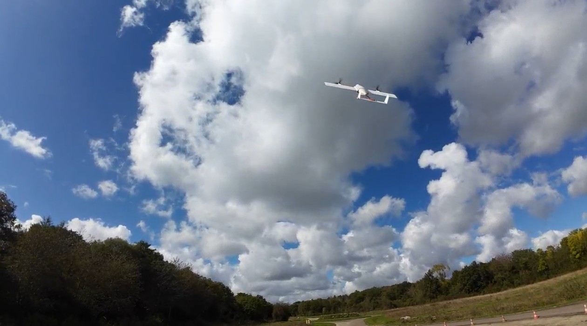

# Dépôt du projet SiERA - UAV Challenge

Ce dépôt contient le code et les ressources techniques développés dans le cadre du concours Dassault UAV Challenge, visant à concevoir un drone autonome capable de mener des missions d'assistance et de reconnaissance.

## 📌 À propos du projet :
- Développement d’un UAV hybride VTOL.
- Implémentation d’algorithmes d’intelligence embarquée pour la navigation autonome.
- Intégration d’une vision par ordinateur pour la détection de personnes en milieu isolé.
- Développement d’une interface web pour la gestion et le suivi des missions en temps réel.

## 🛠 Contributions et Conventions de Commit :
Nous suivons une syntaxe spécifique pour garantir la traçabilité et la clarté des développements. Merci d'utiliser le format suivant pour vos commits : [Git syntax](docs/gitSyntax.md)

📂 Organisation du dépôt :
- /Web → Application web pour le controle du drone a distance
- /EmbededVideo → Algorithmes de détection de personnes dans les images bruités
- /Telemetry → Protocolede connexion entre le drone et la station sol
- /Test → Test de nouvelles features qui pourraient etre inclusent dans le projet
- /docs → Documentation technique et guides de développement.

📣 Notes importantes :
🔹 Pensez à mettre à jour la documentation après chaque implémentation majeure.
🔹 Utilisez des branches dédiées (feature/nom-feature, fix/nom-fix) avant de merger sur main.
🔹 Assurez-vous de respecter les bonnes pratiques de codage et d’effectuer des revues de code avant tout merge.
